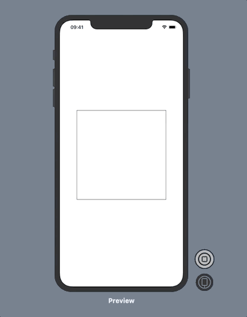

# SegmentedShape

[](https://travis-ci.org/m-housh/SegmentedShape)
[](https://codecov.io/gh/m-housh/SegmentedShape)
[](https://swift.org/package-manager/)
[](https://swift.org)
[](https://developer.apple.com/xcode)
[](https://opensource.org/licenses/MIT)

A SwiftUI package that allows shapes to be broken into segments.  The segments that get drawn at a given time can also be controlled for animations.

## Example
-----------
In this example we will build the following animation that draws each segment of a square, line by line.



```swift

import SwiftUI
import SegmentedShape

struct SegmentedSquare: SegmentedShape {

    var showing: SegmentsShown = .all

    // Note: The container passed into a `Segment` closure contains the
    // current path state and a reference to the bounding `CGRect`.  The same
    // container will get passed to following `Segment`'s ending the drawing
    // based on the `showing` variable.
    
    static var segments = Segments {
        // left
        Segment { container in
            let maxY = container.rect.maxY
            container.path.move(to: CGPoint(x: 0, y: maxY))
            container.path.addLine(to: CGPoint(x: 0, y: 0))
        }
        // top
        Segment { container in
            let maxX = container.rect.maxX
            container.path.addLine(to: CGPoint(x: maxX, y: 0))
        }
        // right
        Segment { container in
            let maxX = container.rect.maxX
            let maxY = container.rect.maxY
            container.path.addLine(to: CGPoint(x: maxX, y: maxY))
        }
        // bottom
        Segment { container in
            let maxY = container.rect.maxY
            container.path.addLine(to: CGPoint(x: 0, y: maxY))
        }
    }
}

struct ContentView: View {
    
    @State var segmentsShown: SegmentsShown = .none
        
    var body: some View {
        ZStack {
            SegmentedSquare(showing: segmentsShown)
                .stroke()
                .frame(width: 300, height: 300, alignment: .center)
        }
        .onAppear() {
            // Animate the drawing of the square line by line.
            for i in 0...SegmentedSquare.segments.count {
                let interval = Double(i) * 0.5 + 0.1
                Timer.scheduledTimer(withTimeInterval: interval, repeats: false) { _ in
                    self.segmentsShown = .max(i)
                }
            }
        }
    }
}

struct ContentView_Previews: PreviewProvider {
    static var previews: some View {
        ContentView()
    }
}

```

